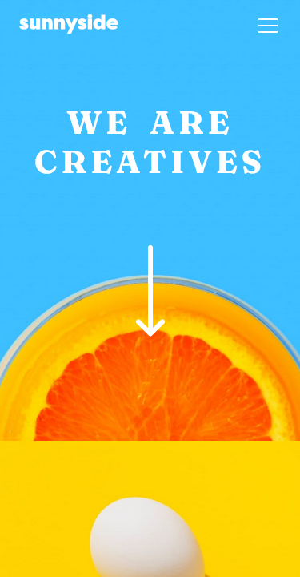
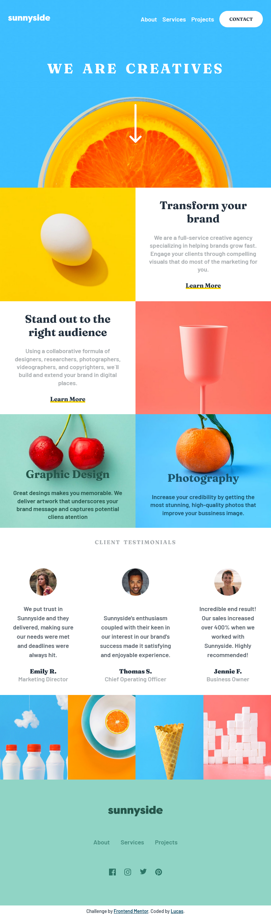

# Frontend Mentor - Sunnyside agency landing page solution

This is a solution to the [Sunnyside agency landing page challenge on Frontend Mentor](https://www.frontendmentor.io/challenges/sunnyside-agency-landing-page-7yVs3B6ef). Frontend Mentor challenges help you improve your coding skills by building realistic projects.

## Table of contents

  - [The challenge](#the-challenge)
  - [Screenshot](#screenshot)
  - [Links](#links)
  - [Built with](#built-with)
  - [Useful resources](#useful-resources)
- [Author](#author)

### The challenge

Users should be able to:

- View the optimal layout for the site depending on their device's screen size
- See hover states for all interactive elements on the page

### Screenshot

### Links

- Solution URL: [GitHub](https://github.com/lucas26a/sunnyside-landing-page)
- Live Site URL: [Netlify](https://bad-sunnysideagency-landingpage.netlify.app/)

## My process

### Built with

- Semantic HTML5 markup
- CSS custom properties
- Flexbox
- CSS Grid
- Mobile-first workflow

### Useful resources

- [StackOverflow](https://stackoverflow.com/questions/5804256/image-inside-div-has-extra-space-below-the-image) - extra space below the image.
## Author

- Website - [GitHub](https://github.com/lucas26a)
- Frontend Mentor - [@lucas26a](https://www.frontendmentor.io/profile/lucas26a)
<!-- - Twitter - [@lucas26almeida](https://www.twitter.com/lucas26almeida) -->
